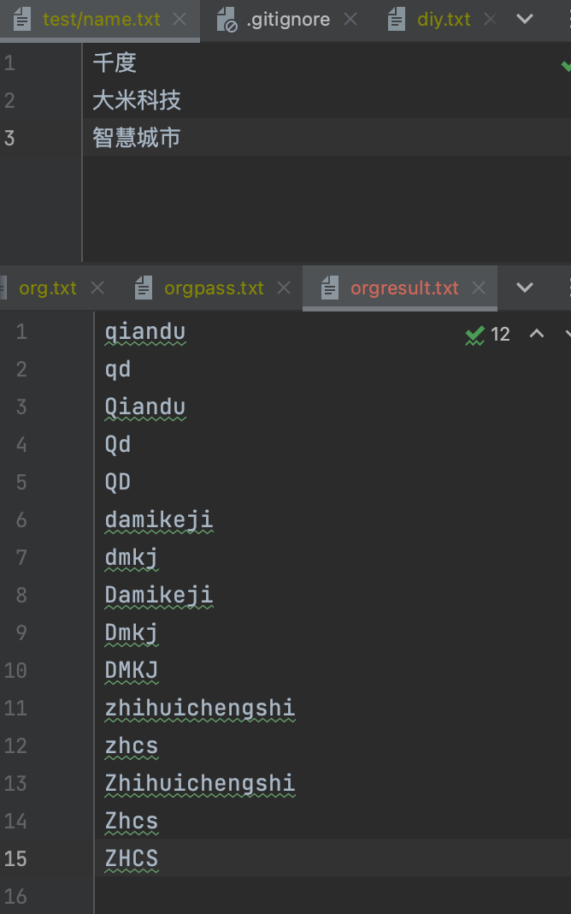
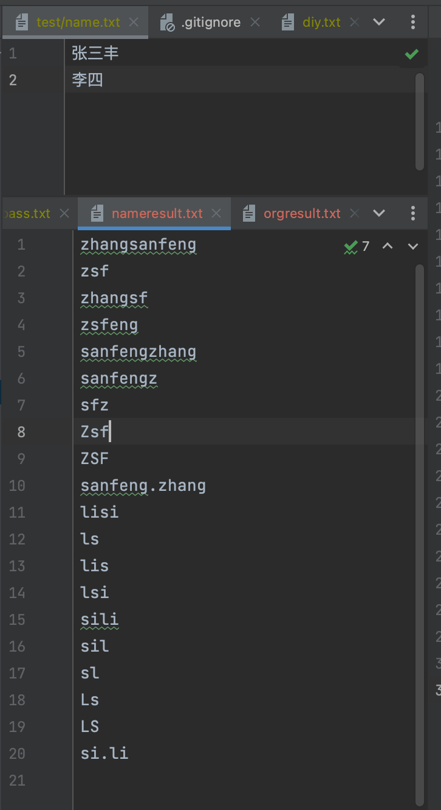
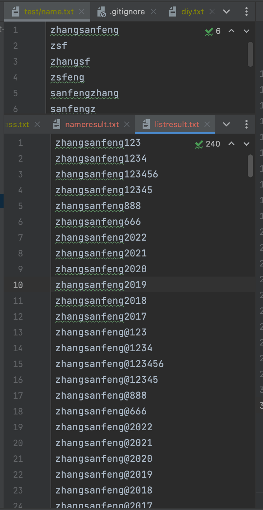

# gendict

针对目标已知信息的字典生成工具

> 交互式版本: https://github.com/ffffffff0x/name-fuzz

> 如果有其他的字典生成思路和规则欢迎在 issue 提出来

---

## 开始

**1. 下载**

- 从 [releases](https://github.com/ffffffff0x/gendict/releases) 进行下载

**2. 支持选项**

```bash
Usage:
    gendict [flags]

INPUT:
    -org            组织名称列表
    -name           用户名称列表
    -list           批量拼接后缀

OUTPUT:
    -orgout         组织名称结果输出 (default "org.txt")
    -nameout        用户名称结果输出 (default "name.txt")
    -listout        批量拼接结果输出 (default "list.txt")

CONFIGURATIONS:
    -suffix         自定义后缀
```

**3. 使用**

```bash
# 对控股公司、子公司列表进行字典生成
./gendict -org test.txt

# 对已知员工列表进行字典生成,指定输出到 /tmp/out.txt 中
./gendict -name test.txt -nameout /tmp/out.txt

# 提供一个已知用户名列表
./gendict -list username.txt

# 提供一个已知用户名列表,使用自定义后缀列表
./gendict -list username.txt -suffix passuffix.txt
```







---

## 支持规则

### 组织名称列表

`公司/单位/组织名称`
- baidu
- bd
- Baidu
- Bd
- BD

### 用户名称列表

`人员名称`
- zhangsanfeng (拼音)
- zsf (缩写)
- zhangsf (首字拼音+缩写)
- zsfeng (缩写+尾字拼音)
- sanfengzhang (拼音+首字拼音)
- sanfengz (拼音+首字缩写)
- sfz (缩写+首字缩写)
- 张三丰 (中文)
- ZSF (缩写大写)
- Zsf (大写缩写+小写缩写)
- sanfeng.zhang (拼音+`.`+首字拼音)

---

## 参考项目

- https://github.com/mozillazg/python-pinyin
- https://github.com/soxoj/username-generation-guide
- https://github.com/WangYihang/ccupp
- https://gist.github.com/yuikns/387be5e9cf450ae3589fa7037c94453e
- https://www.yuque.com/pmiaowu/bomi9w/ougg6d#d70159da
- https://github.com/ffffffff0x/name-fuzz
- https://github.com/RicterZ/genpAss/

---

## License

[Apache License 2.0](https://github.com/ffffffff0x/gendict/blob/main/LICENSE)

---

> create by ffffffff0x
